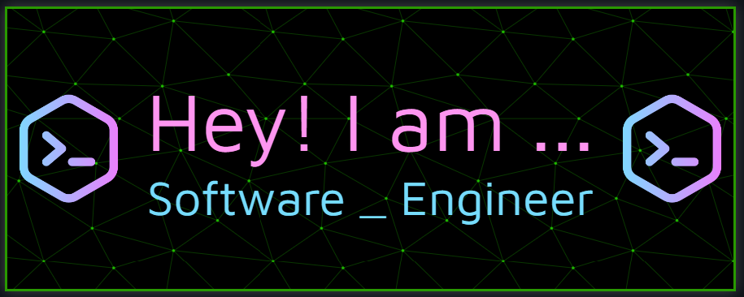

# 💫 About Me:
🔭 I’m currently working on a project called FontChanger 🌱 I’m currently learning Ruby, C++ and C# 💬 Ask me about code debugging 
🌐 Check out my site: https://chudnovsky.neocities.org/

## 🌐 Socials:
    

# 💻 Tech Stack:
                     
# 📊 GitHub Stats:
 
 

## 🏆 GitHub Trophies

### ✍️ Random Dev Quote

---

<!-- Proudly created with GPRM ( https://gprm.itsvg.in ) -->
